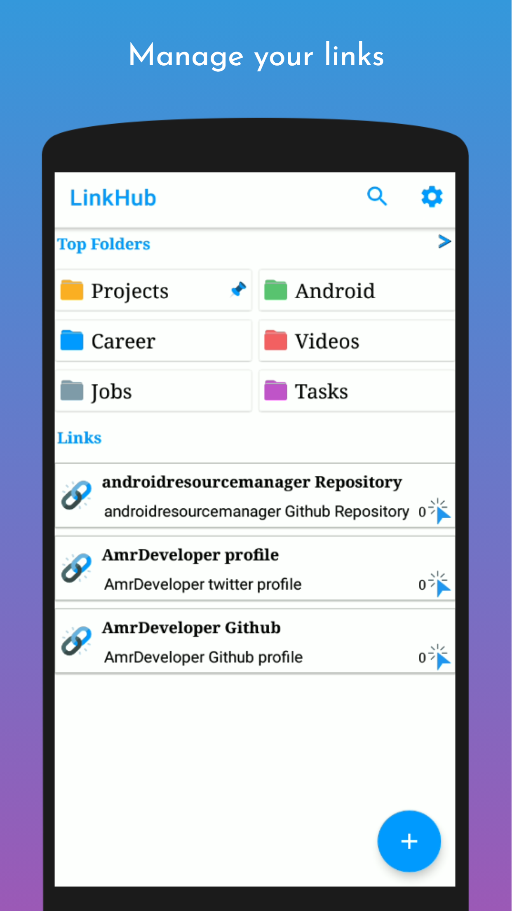
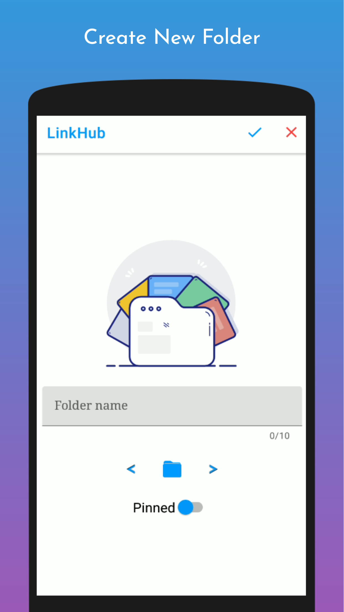
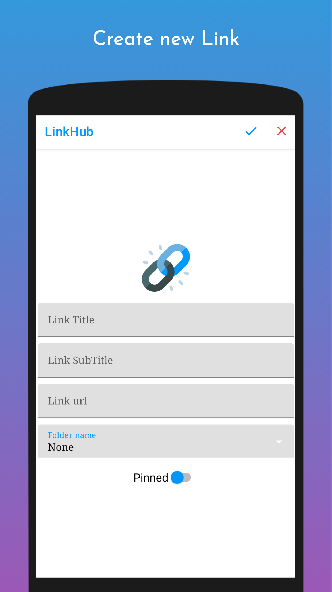

# LinkHub
LinkHub is a simple and effective link management application that can help you to easily manage your own links with no ads!

## Screenshots

  
  
  

LinkHub enabled you to create folders and put your links inside them to classify them and find your link easily and fast, also you can use searching with link title. 

In Link Hub links are automatically sorted depend on if they are pinned and how many times you use them, and the same for Folder.

With LinkHub you can copy, edit, open your link just by one click

## Features
- Free And open source with no ads
- Create Folder with name and multi colors
- Create Link with title, subtitle, url
- Links and Folders are sorted depending on your usage
- Search easily in links and folders
- Shortcuts, Context menu and receive links from other apps
- Auto generated title and subtitle for shared links
- Swipe to delete links on Home with undo option
- Dark theme support
- Import and Export the data in JSON Format
- Widget for Pinned links

You can put each similar link in the same folder, for example, folders for e-books, jobs, courses, talks, articles... etc

## Dependencies
- Dagger Hilt
- Kotlin Coroutines
- Navigation Component
- Room
- LiveData, ViewModel, Fragment Extension
- Timber, LeakCanary